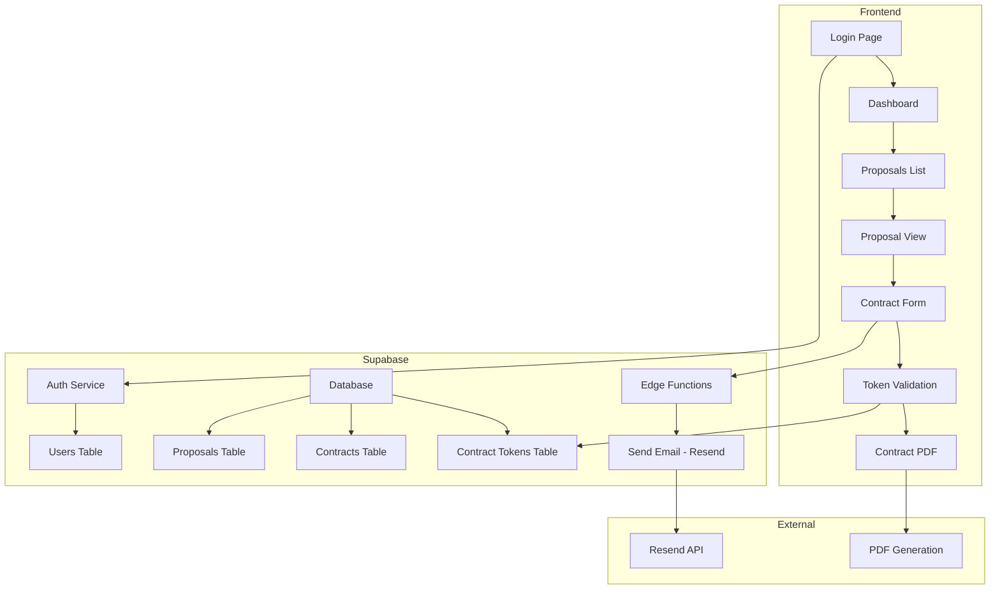
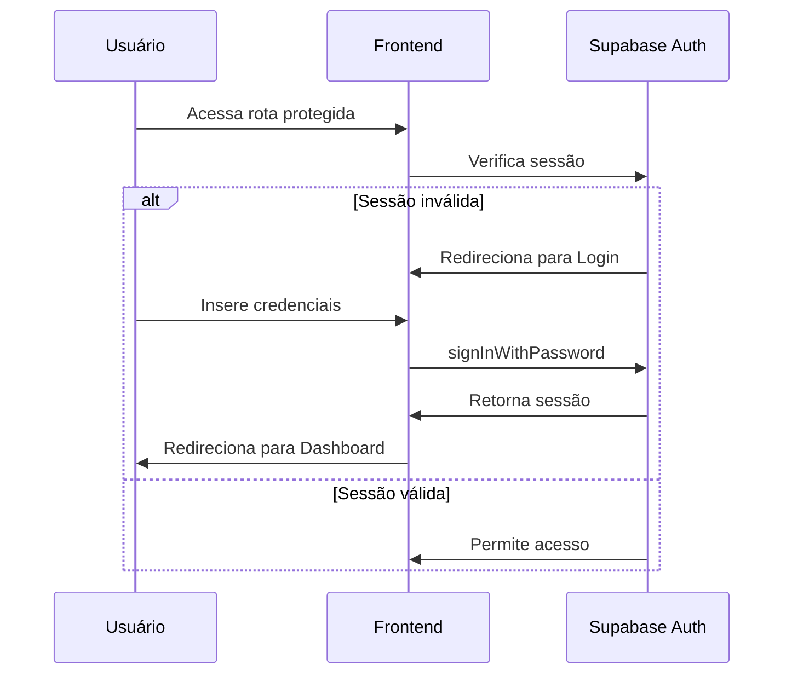
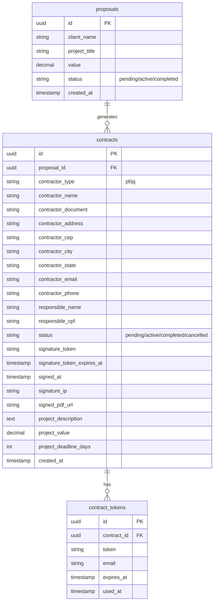
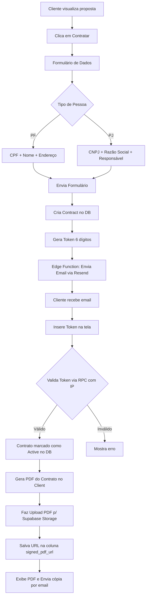

# Plano de Implementação - Sistema de Contratos

## Visão Geral

Este documento descreve a implementação de 4 funcionalidades principais:
1. **Auth Supabase** - Login e redefinição de senha
2. **Sistema de Contratos** - Geração, assinatura e download
3. **Status de Propostas** - Pendente, Ativo, Concluído
4. **Dashboard Widgets** - Resumo visual dos contratos

---

## Arquitetura do Sistema



---

## FASE 1: Auth Supabase

### 1.1 Estrutura de Arquivos

```
src/
├── contexts/
│   └── AuthContext.tsx       # Contexto de autenticação
├── pages/
│   ├── Login.tsx             # Tela de login
│   ├── ResetPassword.tsx     # Solicitar redefinição
│   └── UpdatePassword.tsx    # Nova senha
├── components/
│   └── ProtectedRoute.tsx    # HOC para rotas protegidas
└── lib/
    └── supabase.ts           # Cliente Supabase (já existe)
```

### 1.2 Fluxo de Autenticação



### 1.3 Tarefas

- [ ] Criar `AuthContext.tsx` com estados de loading, user, session
- [ ] Criar `ProtectedRoute.tsx` para proteger rotas
- [ ] Criar `Login.tsx` com formulário email/senha
- [ ] Criar `ResetPassword.tsx` para solicitar email de redefinição
- [ ] Criar `UpdatePassword.tsx` para definir nova senha
- [ ] Atualizar `App.tsx` com novas rotas

---

## FASE 2: Estrutura do Banco de Dados

### 2.1 SQL - Criar Tabelas

```sql
-- =====================================================
-- TABELA: contracts
-- Armazena os contratos gerados a partir de propostas
-- =====================================================
CREATE TABLE IF NOT EXISTS contracts (
    id UUID PRIMARY KEY DEFAULT uuid_generate_v4(),
    proposal_id UUID REFERENCES proposals(id) ON DELETE CASCADE,
    
    -- Dados do Contratante (preenchidos no formulário)
    contractor_type TEXT NOT NULL CHECK (contractor_type IN ('pf', 'pj')),
    contractor_name TEXT NOT NULL,                    -- Nome completo ou Razão Social
    contractor_document TEXT NOT NULL,                -- CPF ou CNPJ
    contractor_address TEXT NOT NULL,                 -- Endereço completo
    contractor_cep TEXT NOT NULL,                     -- CEP
    contractor_city TEXT NOT NULL,                    -- Cidade
    contractor_state TEXT NOT NULL,                   -- Estado (UF)
    contractor_email TEXT NOT NULL,                   -- Email
    contractor_phone TEXT NOT NULL,                   -- Telefone
    
    -- Dados do Responsável (apenas para PJ)
    responsible_name TEXT,                            -- Nome do responsável
    responsible_cpf TEXT,                             -- CPF do responsável
    
    -- Status do Contrato
    status TEXT NOT NULL DEFAULT 'pending' CHECK (status IN ('pending', 'active', 'completed', 'cancelled')),
    
    -- Assinatura
    signature_token TEXT,                             -- Token de autorização
    signature_token_expires_at TIMESTAMP WITH TIME ZONE,  -- Expiração do token
    signed_at TIMESTAMP WITH TIME ZONE,               -- Data da assinatura
    signature_ip TEXT,                                -- IP usado na assinatura
    signed_pdf_url TEXT,                              -- URL do PDF assinado no Storage
    
    -- Dados do Projeto (copiados da proposta)
    project_description TEXT,                         -- Descrição do projeto
    project_value DECIMAL(10,2),                      -- Valor total
    project_deadline_days INTEGER,                    -- Prazo em dias
    
    -- Timestamps
    created_at TIMESTAMP WITH TIME ZONE DEFAULT NOW(),
    updated_at TIMESTAMP WITH TIME ZONE DEFAULT NOW()
);

-- Índices para performance
CREATE INDEX idx_contracts_proposal_id ON contracts(proposal_id);
CREATE INDEX idx_contracts_status ON contracts(status);
CREATE INDEX idx_contracts_signature_token ON contracts(signature_token);

-- =====================================================
-- TABELA: contract_tokens
-- Tokens temporários para validação de assinatura
-- =====================================================
CREATE TABLE IF NOT EXISTS contract_tokens (
    id UUID PRIMARY KEY DEFAULT uuid_generate_v4(),
    contract_id UUID REFERENCES contracts(id) ON DELETE CASCADE,
    token TEXT NOT NULL UNIQUE,                       -- Token de 6 dígitos
    email TEXT NOT NULL,                              -- Email destinatário
    expires_at TIMESTAMP WITH TIME ZONE NOT NULL,     -- Expiração (15 min)
    used_at TIMESTAMP WITH TIME ZONE,                 -- Quando foi usado
    created_at TIMESTAMP WITH TIME ZONE DEFAULT NOW()
);

-- Índice para busca rápida por token
CREATE INDEX idx_contract_tokens_token ON contract_tokens(token);
CREATE INDEX idx_contract_tokens_contract_id ON contract_tokens(contract_id);

-- =====================================================
-- ADICIONAR: Campo status na tabela proposals
-- =====================================================
ALTER TABLE proposals 
ADD COLUMN IF NOT EXISTS status TEXT NOT NULL DEFAULT 'pending' 
CHECK (status IN ('pending', 'active', 'completed'));

-- Atualizar propostas existentes
UPDATE proposals SET status = 'pending' WHERE status IS NULL;

-- =====================================================
-- RLS - Row Level Security
-- =====================================================

-- Habilitar RLS nas novas tabelas
ALTER TABLE contracts ENABLE ROW LEVEL SECURITY;
ALTER TABLE contract_tokens ENABLE ROW LEVEL SECURITY;

-- Políticas para contracts
-- Leitura pública baseada no UUID (imprevisível) para o cliente ver e assinar
CREATE POLICY "Public can view contracts" ON contracts
    FOR SELECT USING (true);

-- Permite inserção pública (pois o cliente sem login preenche os dados)
CREATE POLICY "Public can insert contracts" ON contracts
    FOR INSERT WITH CHECK (true);

-- Atualização pública permitida apenas se o contrato estiver pendente
CREATE POLICY "Public can update pending contracts" ON contracts
    FOR UPDATE USING (status = 'pending');

-- Políticas para contract_tokens
CREATE POLICY "Users can view tokens" ON contract_tokens
    FOR SELECT USING (auth.uid() IS NOT NULL);

CREATE POLICY "Users can insert tokens" ON contract_tokens
    FOR INSERT WITH CHECK (auth.uid() IS NOT NULL);

CREATE POLICY "Users can update tokens" ON contract_tokens
    FOR UPDATE USING (auth.uid() IS NOT NULL);

-- =====================================================
-- FUNÇÃO: Limpar tokens expirados (executar periodicamente)
-- =====================================================
CREATE OR REPLACE FUNCTION clean_expired_tokens()
RETURNS void AS $$
BEGIN
    DELETE FROM contract_tokens 
    WHERE expires_at < NOW();
END;
$$ LANGUAGE plpgsql SECURITY DEFINER;

-- =====================================================
-- FUNÇÃO: Validar token de assinatura e ativar contrato
-- =====================================================
CREATE OR REPLACE FUNCTION validate_signature_token(
    p_contract_id UUID,
    p_token TEXT,
    p_ip_address TEXT
) RETURNS BOOLEAN AS $$
DECLARE
    v_token_id UUID;
BEGIN
    SELECT id INTO v_token_id FROM contract_tokens
    WHERE contract_id = p_contract_id AND token = p_token AND expires_at > NOW() AND used_at IS NULL;

    IF v_token_id IS NOT NULL THEN
        UPDATE contract_tokens SET used_at = NOW() WHERE id = v_token_id;
        UPDATE contracts SET status = 'active', signed_at = NOW(), signature_ip = p_ip_address WHERE id = p_contract_id;
        RETURN TRUE;
    END IF;
    RETURN FALSE;
END;
$$ LANGUAGE plpgsql SECURITY DEFINER;
```

### 2.2 Diagrama ER



---

## FASE 3: Fluxo de Contratos

### 3.1 Fluxo Completo



### 3.2 Estrutura de Arquivos

```
src/
├── pages/
│   ├── ContractForm.tsx      # Formulário de dados
│   └── ContractSign.tsx      # Validação do token + PDF
├── components/
│   └── ContractPDF.tsx       # Template do PDF
└── lib/
    └── contract-template.ts  # Gerador de texto do contrato

supabase/
└── functions/
    └── send-contract-email/
        └── index.ts          # Edge Function
```

### 3.3 Edge Function - Envio de Email

```typescript
// supabase/functions/send-contract-email/index.ts
import { serve } from "https://deno.land/std@0.168.0/http/server.ts"
import { createClient } from 'https://esm.sh/@supabase/supabase-js@2'

const RESEND_API_KEY = 're_hDoeJBry_Jqk3mb31yMX3oUJ69PuqYyLN'

serve(async (req) => {
  try {
    const { contractId, email, token } = await req.json()
    
    // Enviar email via Resend
    const response = await fetch('https://api.resend.com/emails', {
      method: 'POST',
      headers: {
        'Authorization': `Bearer ${RESEND_API_KEY}`,
        'Content-Type': 'application/json',
      },
      body: JSON.stringify({
        from: 'contratos@solvehub.design',
        to: email,
        subject: 'Token de Autorização - Assinatura de Contrato',
        html: `
          <h1>Assinatura de Contrato</h1>
          <p>Seu token de autorização é:</p>
          <h2 style="font-size: 32px; letter-spacing: 8px; color: #f97316;">${token}</h2>
          <p>Este token expira em 15 minutos.</p>
        `,
      }),
    })

    const data = await response.json()
    
    return new Response(JSON.stringify({ success: true, data }), {
      headers: { 'Content-Type': 'application/json' },
    })
  } catch (error) {
    return new Response(JSON.stringify({ error: error.message }), {
      status: 400,
    })
  }
})
```

### 3.4 Template do Contrato (Mapeamento)

O modelo de contrato em [`modelocontrato.md`](modelocontrato.md) será preenchido com:

| Campo do Contrato | Origem dos Dados |
|-------------------|------------------|
| CONTRATANTE (nome) | `contractor_name` |
| CNPJ/CPF | `contractor_document` |
| Endereço | `contractor_address` |
| Representante | `responsible_name` (se PJ) |
| CPF Representante | `responsible_cpf` (se PJ) |
| Email | `contractor_email` |
| Telefone | `contractor_phone` |
| Objeto (1.1) | `project_description` |
| Prazo (dias) | `project_deadline_days` |
| Valor Total | `project_value` |
| Data | Data atual |

---

## FASE 4: Dashboard Widgets

### 4.1 Widgets de Resumo

```
┌─────────────────────────────────────────────────────────────┐
│  Dashboard                                                   │
├─────────────────────────────────────────────────────────────┤
│  ┌──────────┐  ┌──────────┐  ┌──────────┐  ┌──────────┐    │
│  │ Pendentes│  │  Ativos  │  │Concluídos│  │  Total   │    │
│  │    5     │  │    12    │  │    38    │  │    55    │    │
│  │  🟡      │  │   🟢     │  │   🔵     │  │   ⚫     │    │
│  └──────────┘  └──────────┘  └──────────┘  └──────────┘    │
│                                                             │
│  ┌─────────────────────────────────────────────────────┐   │
│  │  Lista de Propostas/Contratos                        │   │
│  │  ───────────────────────────────────────────────────│   │
│  │  Cliente A  │ Projeto X  │ R$ 5.000  │ 🟡 Pendente  │   │
│  │  Cliente B  │ Projeto Y  │ R$ 8.000  │ 🟢 Ativo     │   │
│  │  Cliente C  │ Projeto Z  │ R$ 3.000  │ 🔵 Concluído │   │
│  └─────────────────────────────────────────────────────┘   │
└─────────────────────────────────────────────────────────────┘
```

### 4.2 Badges de Status

```tsx
// Componente de Badge
const statusConfig = {
  pending: { label: 'Pendente', color: 'bg-yellow-500/20 text-yellow-400 border-yellow-500/30' },
  active: { label: 'Ativo', color: 'bg-green-500/20 text-green-400 border-green-500/30' },
  completed: { label: 'Concluído', color: 'bg-blue-500/20 text-blue-400 border-blue-500/30' },
  cancelled: { label: 'Cancelado', color: 'bg-red-500/20 text-red-400 border-red-500/30' },
}
```

---

## Ordem de Execução Recomendada

1. **FASE 1** - Auth Supabase (base para tudo)
2. **FASE 2** - Executar SQL no Supabase
3. **FASE 3** - Fluxo de Contratos
   - 3.1 e 3.2 primeiro (frontend)
   - 3.3 Edge Function
   - 3.4 a 3.6 (validação e PDF)
4. **FASE 4** - Dashboard Widgets

---

## Variáveis de Ambiente Necessárias

```env
# Frontend (.env)
VITE_SUPABASE_URL=your_supabase_url
VITE_SUPABASE_ANON_KEY=your_anon_key

# Supabase Edge Function
RESEND_API_KEY=re_hDoeJBry_Jqk3mb31yMX3oUJ69PuqYyLN
```

---

## Dependências NPM a Instalar

```bash
npm install @react-pdf/renderer  # Geração de PDF
npm install react-router-dom      # Já instalado
```

---

## Próximos Passos

Após aprovação deste plano, iniciar a implementação na seguinte ordem:

1. Criar SQL e executar no Supabase
2. Implementar Auth (Login + Reset Password)
3. Criar fluxo de contratos
4. Adicionar widgets ao Dashboard
